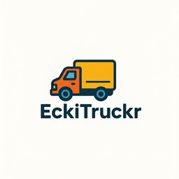

# eckitruckr

## Proyecto para el hackatón de IV 2025-26
Este proyecto está siendo desarrollado para la asignatura Infraestructura Virtual impartida en Ingeniería Informática en la UGR, el fin de su realización en el hackaton de las prácticas de la asignatura para el año 2026-2026 es el aprendizaje de la metodología y desarrollo correctos de una aplicación a nivel profesional.
Como base se presentaron varios problemas de los cuales finalmente elegimos el descrito más abajo. En base a este problema hemos, iniciado el desarrollo de una aplicación para resolverlo a la que hemos denominado "EckiTruckr".
A continuación se presenta el proyecto en profundidad.

## Descripción del problema
En muchas cooperativas de transporte, la asignación de viajes se gestiona mediante un sistema sencillo: los camioneros apuntan su nombre y hora de llegada en una pizarra, y los viajes se van asignando en orden, priorizando a quien lleva más tiempo parado.

Aunque este sistema busca ser justo, en la práctica genera dos problemas principales:

- **Destinos lejanos:** algunos camioneros reciben de manera repetida viajes de larga distancia, lo que implica mayor desgaste físico, más tiempo en carretera y menos tiempo en casa.  

- **Rentabilidad desigual:** otros camioneros son asignados con frecuencia a viajes que generan mayor rentabilidad económica, provocando diferencias en los ingresos pese a que todos realizan el mismo trabajo.  

En conjunto, esto da lugar a una **distribución inequitativa de los viajes**, tanto en términos de esfuerzo como de beneficio económico, afectando a la equidad y satisfacción de los trabajadores.

## Licencia
Eckitruckr tiene licencia [GNU AGPLv3](LICENSE). 

Permite:  
- Uso comercial  
- Modificación  
- Distribución  
- Uso de patentes  
- Uso privado  

No permite:  
- Responsabilidad  
- Garantía  

